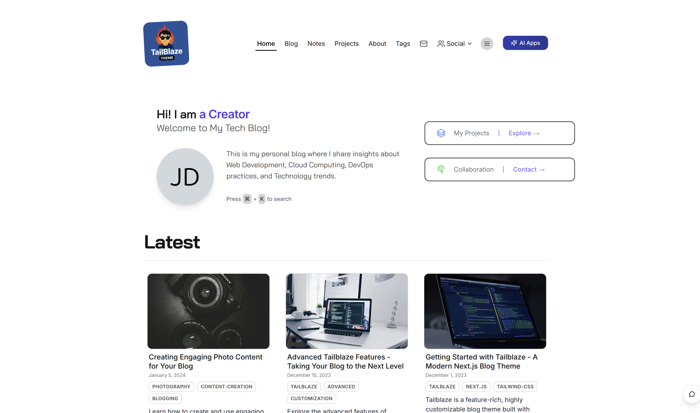
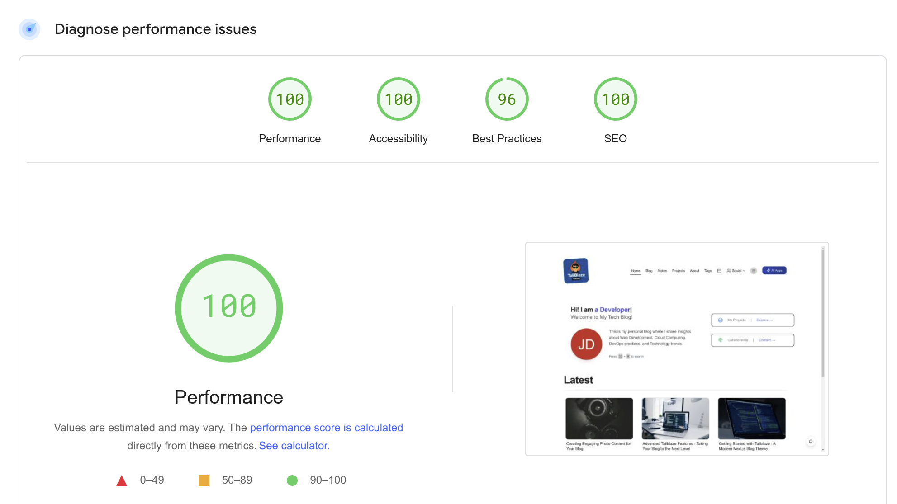

<div align="center">

# 🚀 Tailblaze

### Modern Tailwind NextJS Blog Starter Theme with Perfect PageSpeed Score

[](https://nextjs.org/)
[](https://tailwindcss.com/)
[](https://www.typescriptlang.org/)
[](LICENSE)
[](https://pagespeed.web.dev/)

A beautiful, feature-rich blog starter with modern tech stack and perfect performance.

[Demo](https://tailblaze.vietanh.dev) • [Documentation](https://github.com/yourusername/tailblaze/wiki) • [Report Bug](https://github.com/vietanhdev/tailblaze/issues) • [Request Feature](https://github.com/vietanhdev/tailblaze/issues)





</div>

## ✨ Features

<div align="center">

|          |                                                                                                                    |
| -------- | ------------------------------------------------------------------------------------------------------------------ |
| ⚡️ | **Blazing Fast** - Static site generation with Next.js for lightning-quick load times                           |
| 🎨 | **Beautiful Design** - Modern UI crafted with Tailwind CSS and shadcn/ui components                            |
| 📱 | **Fully Responsive** - Perfect viewing experience across all devices                                           |
| ✍️ | **MDX Support** - Write content with Markdown and embed React components                                       |
| 📊 | **SEO Optimized** - Built-in SEO components and metadata configuration                                         |
| 📂 | **Content Organization** - Well-structured file system for blog posts and notes                                |
| 🔍 | **Search Functionality** - Built-in content discovery                                                          |
| 📱 | **PWA Ready** - Progressive Web App support for installation                                                   |
| 📈 | **Analytics Integration** - Easy setup with popular analytics platforms                                        |
| 💬 | **Comments System** - Multiple provider options (Disqus, Utterances)                                           |
| 📧 | **Newsletter** - Subscription form with popular service integrations                                           |
| 🔄 | **RSS Feed** - Automatic feed generation for your content                                                      |

</div>

## 🚀 Quick Start

```bash
# Clone the repository
git clone https://github.com/vietanhdev/tailblaze.git my-blog

# Navigate to the directory
cd my-blog

# Install dependencies
pnpm install

# Start the development server
pnpm dev
```

Visit `http://localhost:3000` to see your blog in action.

## 📖 Documentation

For detailed documentation and guides, visit our [documentation site](https://github.com/yourusername/tailblaze/wiki).

## 🏗️ Deployment

### Build for Production

```bash
pnpm run build-images
pnpm build
```

The static site will be generated in the `out` directory.

### Deploy to Vercel (Recommended)

The easiest way to deploy your Tailblaze blog:

[](https://vercel.com/new/clone?repository-url=https%3A%2F%2Fgithub.com%2Fvietanhdev%2Ftailblaze)

### Deploy to Cloudflare Pages

Deploy to Cloudflare Pages in a few simple steps:

1. Push your repository to GitHub or GitLab
2. Log in to the [Cloudflare Dashboard](https://dash.cloudflare.com/)
3. Select **Pages** > **Create a project** > **Connect to Git**
4. Select your repository
5. Configure build settings:
   - **Build command:** `pnpm run build-images && pnpm build`
   - **Build output directory:** `out`
   - **Node.js version:** `18` (or higher)
   - **Build system version:** `2`
6. Add environment variables:
   - `NODE_VERSION`: `18`
   - `NPM_FLAGS`: `--version`
   - `PNPM_VERSION`: `8.6.0`
7. Click **Save and Deploy**

> **Note:** Tailblaze is configured for static exports with `output: 'export'` in `next.config.js`

## ⚙️ Customization

| Area | How to Customize |
|------|------------------|
| **Site Metadata** | Edit `data/siteMetadata.ts` |
| **Navigation** | Modify `data/headerNavLinks.ts` |
| **Theme** | Adjust `tailwind.config.js` |
| **Components** | Customize in the `components` directory |
| **Pages** | Modify or add in the `pages` directory |

## 📝 Content Management

- **Blog Posts**: Add Markdown or MDX files to `data/blog`
- **Notes**: Add shorter content to `data/notes`
- **Images**: Store in `public/static/images`

## 🖼️ Free Image Resources

| Resource | Description |
|----------|-------------|
| [Unsplash](https://unsplash.com) | High-quality free photos |
| [Pexels](https://pexels.com) | Free stock photos and videos |
| [Pixabay](https://pixabay.com) | Free images and royalty-free stock |
| [StockSnap.io](https://stocksnap.io) | Beautiful free stock photos |
| [Undraw](https://undraw.co) | Open-source illustrations |

## 📋 Blog Post Templates

Tailblaze includes several ready-to-use blog post templates:

- Basic blog post
- Tutorial with code snippets
- Photo gallery
- Video post
- Link collection
- Quote/commentary

## ⚡ Performance Optimization

Tailblaze is optimized for performance with:

- Code splitting for faster page loads
- Image optimization with next-image-export-optimizer
- Font optimization
- Minimal dependencies
- CSS purging with Tailwind CSS

## 👥 Contributing

Contributions are welcome! Please feel free to submit a Pull Request.

## 📄 License

- **Source code**: [MIT License](LICENSE)
- **Content**: Copyrighted by respective authors, all rights reserved.

## 🙏 Credits

- Original theme by [timlrx](https://github.com/timlrx/tailwind-nextjs-starter-blog)
- Built with [Next.js](https://nextjs.org/) and [Tailwind CSS](https://tailwindcss.com/)
- UI components from [shadcn/ui](https://ui.shadcn.com/)

---

<div align="center">

Built with ❤️ by [Viet-Anh Nguyen](https://github.com/vietanhdev)

</div>
